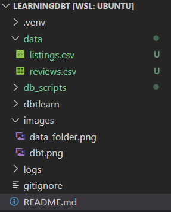

<h1> Learning dbt (Data Build Tool) </h1>


#### Introduction

This repository contains the code required for learning dbt (data build tool) and setting up your own dbt project for hands-on practice.

I have followed [this Udemy course](https://www.udemy.com/course/complete-dbt-data-build-tool-bootcamp-zero-to-hero-learn-dbt/?couponCode=NVDIN35) for my learning.

Please note that this course uses Snowflake as the data platform for the dbt transformations whereas I have used PostgreSQL for my learning.

But if you want to use Snowflake or data platform, please use [this link](https://docs.getdbt.com/docs/trusted-adapters) to check if they are supported or not.


#### Setting up the environment

**Prerequisites:**
- Have Docker installed in your system, since I have used Docker to host my PostgreSQL database
- Have the latest Python version installed in your system 
- Have Visual Studio Code installed 
- WSL if you using Windows

```
You can use PyCharm as your IDE but since I have worked completely on WSL and since VS Code allows development on WSL while being installled on Windows, it will be easier if you do the same.

But if you want to use PyCharm on Windows, then please check the environment variables. 

If you are using a Macbook, then you can follow the same steps both with VS Code and PyCharm.
```

**Setting up PostgreSQL on Docker:**
- Pull the latest PostgreSQL image using the command: `docker pull postgres`
- Create a volume for the docker container: `docker volume create postgres_data`
- Create the container using the command:
    `docker run --name my_postgres_container -e POSTGRES_PASSWORD=mysecretpassword -d -p 5432:5432 -v postgres_data:/var/lib/postgresql/data postgres`

Once you have created the container, you can start or stop the container using `docker start <container_name>` or `docker stop <container_name>`.

Once the container is up and running, you can connect to the database using the below details:
- Hostname: `localhost`
- Port: `5432`
- Database: `postgres`
- Username: `postgres`
- Password: `the password the you set during the container creation`

```
If you don't want to use Postgres on Docker that is possible too. 

Just install Postgres on your system and use it.
```


**Setting up the dbt environment:**

There are 2 ways in which you can set up the environment

*1. If you want to set up everything from scratch* :
- Open up your IDE of choice and create a virtual environment in Python 
- Once that is done, run the command, `pip install dbt-postgres==1.9.0`(*if you are using any other data platform, please install the correspoding module*)
- Once this is done, run the command `dbt --help` to verify whether dbt core has been installed or not 
- Create a folder using the command `mkdir ~/.dbt`
- Run the command, `dbt init dbtlearn` to initialize a dbt project; here *dbtlearn* is the name of the project but you can use a different name
- When you learn the above command, you will be asked to enter a few details on how to connect to PostgreSQL. Please enter the details accordingly
- Once you have entered the details, you can see the details using the command, `cat .dbt/profiles.yml`
- If you want to update the details later, you can do so by editing the file `~/.dbt/profiles.yml`; you can use the `vi`, `vim` or `nano` to edit the file

*2. If you have cloned this repo* :
- Run the command `pip install -r requirements.txt`
- Once that is done, open up your terminal (WSL in case of Windows), and go to the home directory `cd ~`
- Once that is done, create the `.dbt` directory by running the command `mkdir .dbt`
- Then run the command, `touch .dbt/profiles.yml`
- Once done, open the `profiles.yml` file in your editor of choice and put the below details
```yaml
dbtlearn:
  target: dev
  outputs:
    dev:
      dbname: dbt 
      host: localhost
      pass: <the_database_password_you_set_up>
      port: 5432
      schema: airbnb
      type: postgres
      user: postgres
      threads: 1
```
- Once done, rnu the `dbt debug` command

#### Loading the data
The next step is to create the raw table and then insert data into them.

- The first step is to get the raw data in csv format. In this case I am using the Airbnb datasets that are available online. Go to [this](https://insideairbnb.com/get-the-data/) link and download the `listings.csv` and the `reviews.csv` files for any city. You can download is for more than one city if you want.

- Once you download the data, create a `data` directory as shown below and move your csv files there.



Once the above steps are completed, execute the below steps:
- Run the DDL commands in the `db_scripts/ddl.sql` in your Postgres instance
- Then go to the `profiles.yml` file mentioned above and update the `dbname` field value
- Once done, runt the below 3 scripts. Please enter the name of the dbt project while running each script
    
     - `insert_raw_listings.py`
     - `insert_raw_reviews.py`
     - `insert_raw_hosts.py`

#### Creating models and running them

All the models that are present in the `models` directory can be run using the `dbt run` command.

#### How to load incremental review data using the incremental models
- Download the data from the Airbnb link provided above
- Put the csv file in the `data` directory and run the `insert_raw_reviews.py` script
- Check the count in the `fct_reviews` table before running the model
- Run the model using the `dbt run` command
- Check the count again

*Before*:


*After*:


*Please note that the count in your case can be different based on the dataset that you used*

Also, the number of rows appended to the table can also be seen in the output of the `dbt run` command as can be seen below


- If you want to completely rebuild the table, then run the command `dbt run --full-refresh`


